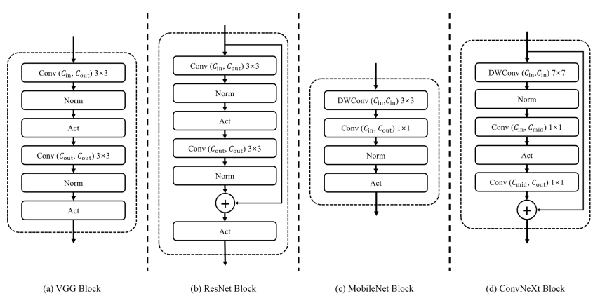
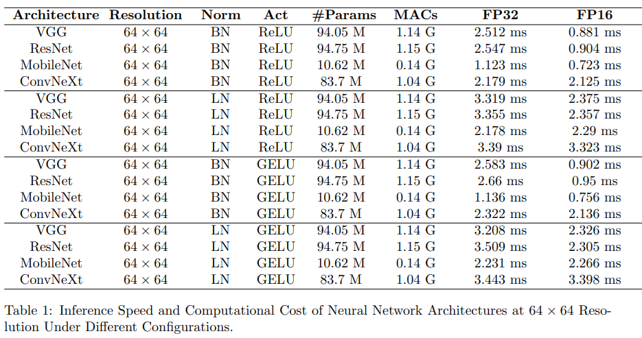
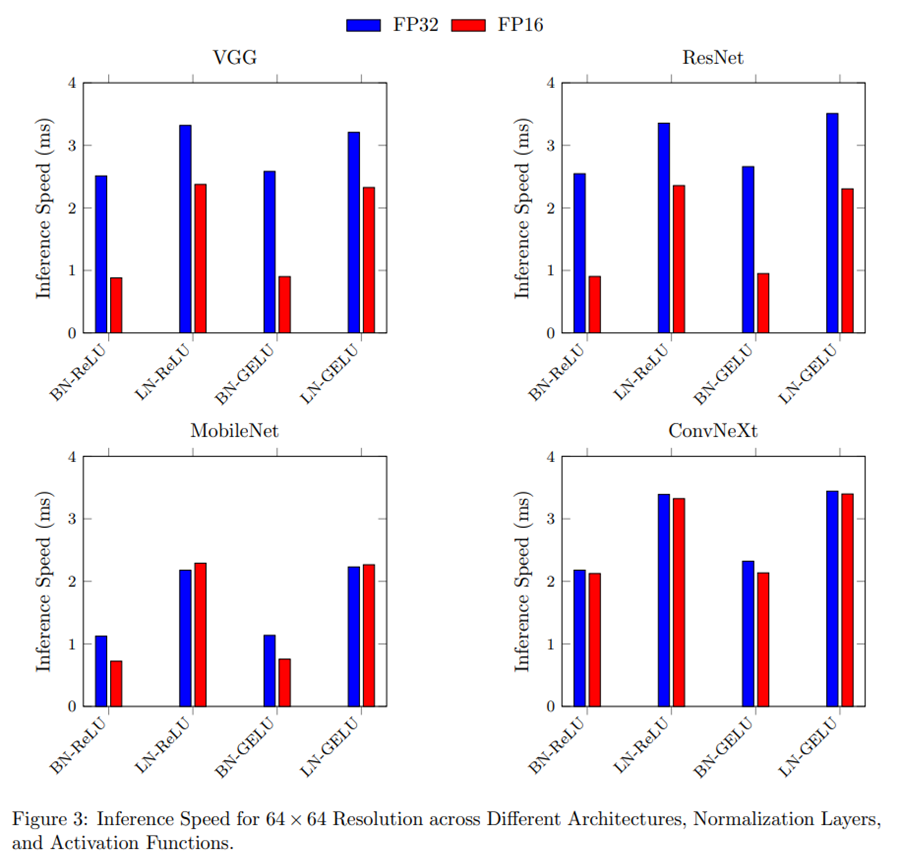
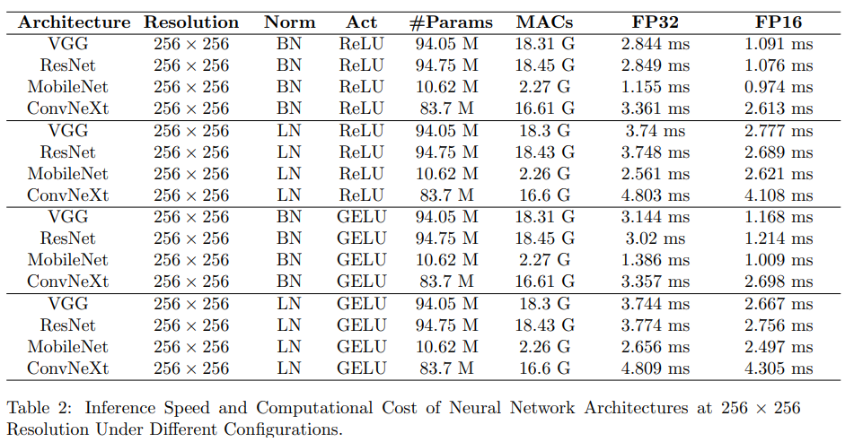
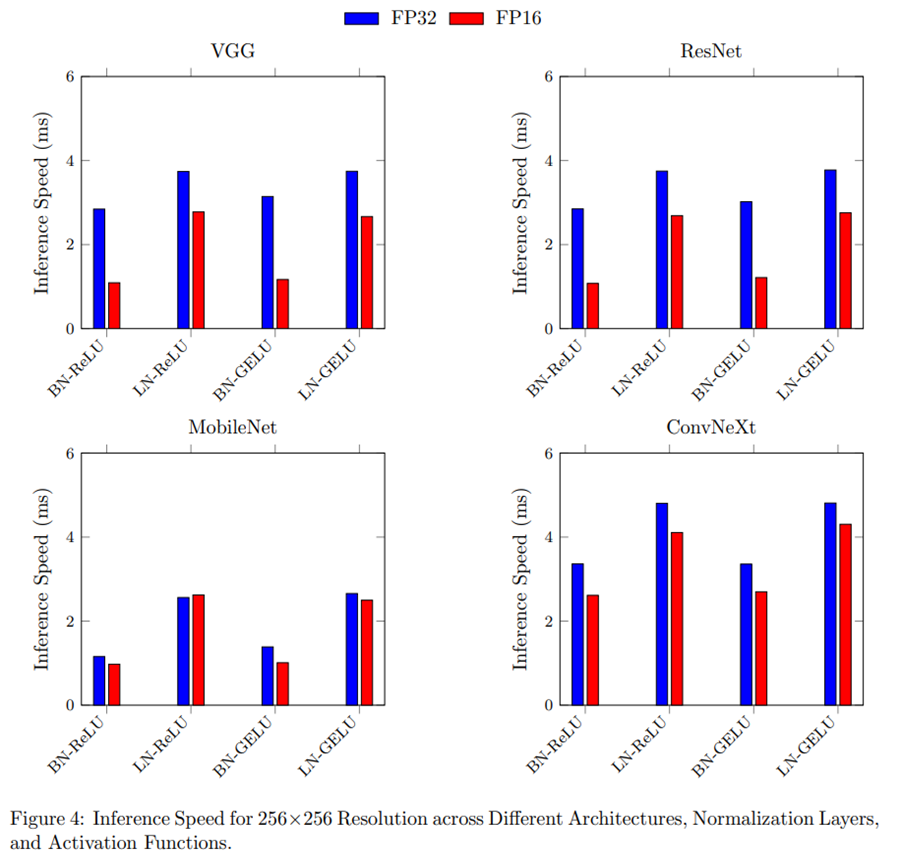
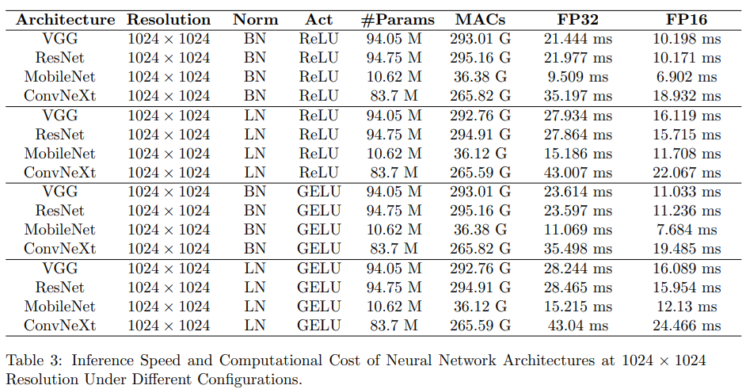
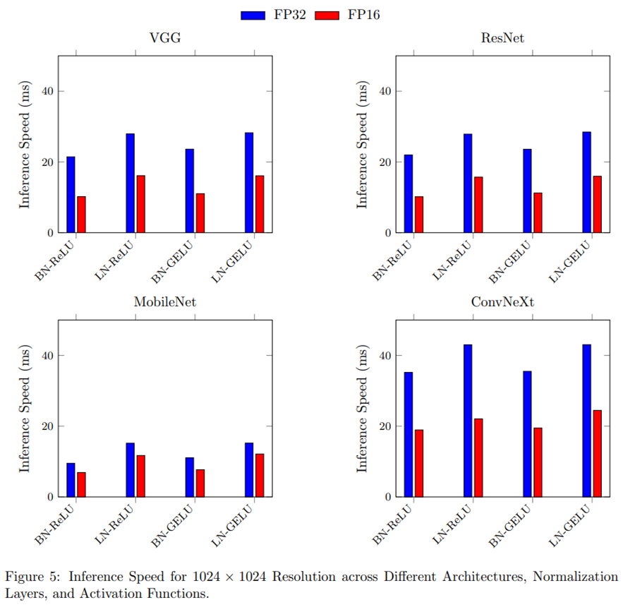

# 다양한 신경망 블록 아키텍처의 TensorRT 추론 속도 비교 분석

## Paper
[다운로드](paper/Comparative_Analysis_of_TensorRT_Inference_Speeds_Across_Various_Neural_Network_Block_Architectures.pdf)

## 개요
이 저장소는 Hwa-Jong Park의 연구 논문 **"Comparative Analysis of TensorRT Inference Speeds Across Various Neural Network Block Architectures"**를 기반으로 한 구현과 결과를 포함하고 있습니다. 본 논문은 다양한 정규화 레이어, 활성화 함수, 입력 해상도 조합에서 신경망 블록의 추론 속도를 체계적으로 분석합니다.

### ChatGPT 활용
이 논문은 ChatGPT를 활용하여 초안을 작성하고 문구를 다듬는 데 사용되었습니다.

## 주요 내용
### 블록 구조

    

### 실험 결과
#### 64×64 해상도 결과

    
    

#### 256×256 해상도 결과

    
    

#### 1024×1024 해상도 결과

    
    

## 한계점
- 실제 데이터셋이 아닌 더미 이미지를 사용하여 실험이 진행되었습니다.
- 단일 하드웨어 구성(NVIDIA GeForce RTX 3090 Ti)에서만 실험하여 결과의 일반화에 제약이 있습니다.
- 추론 속도에만 초점을 맞추었으며, 메모리 사용량, 에너지 효율성, 실제 정확도는 분석 대상에서 제외되었습니다.
