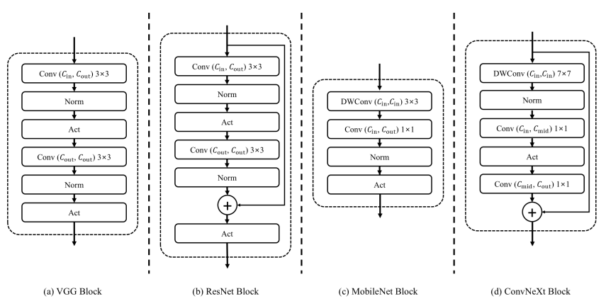
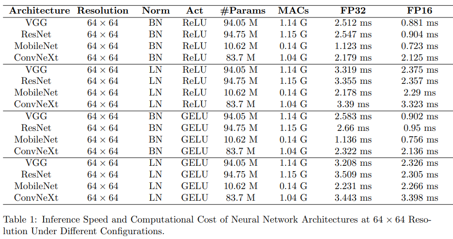
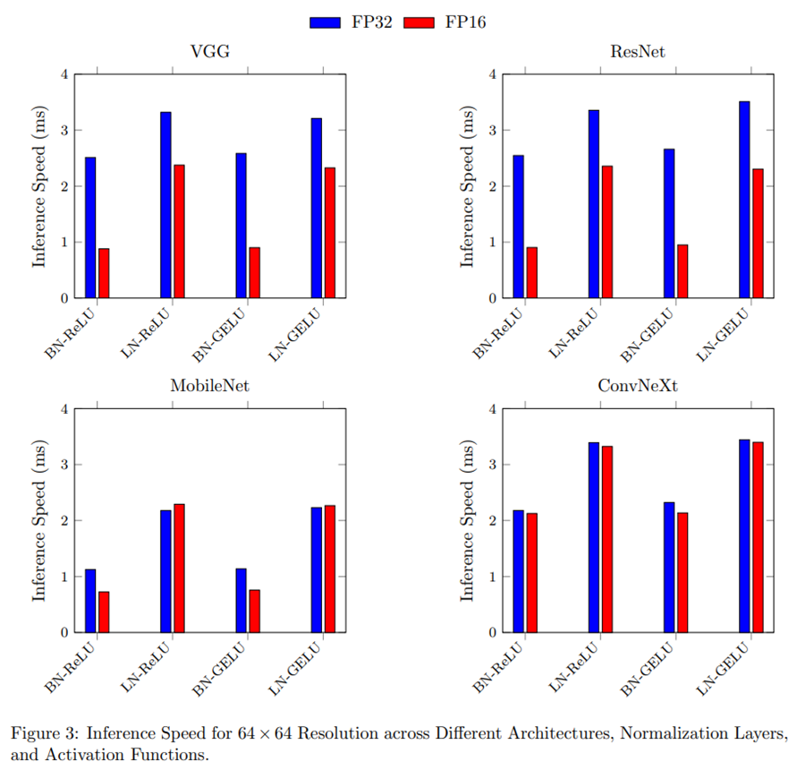
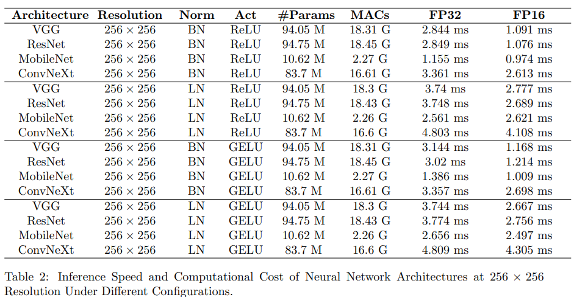
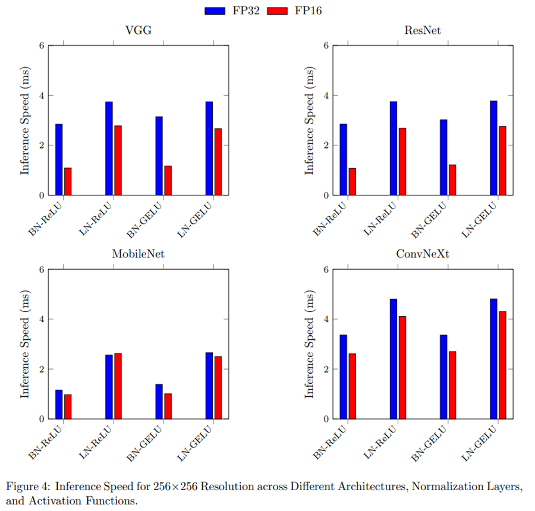
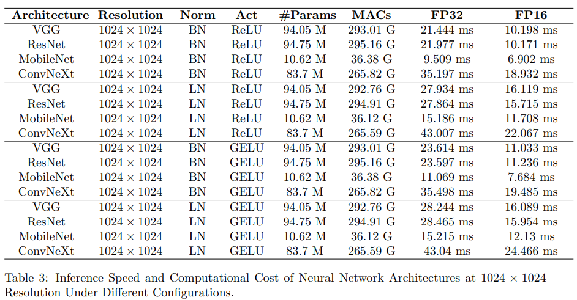
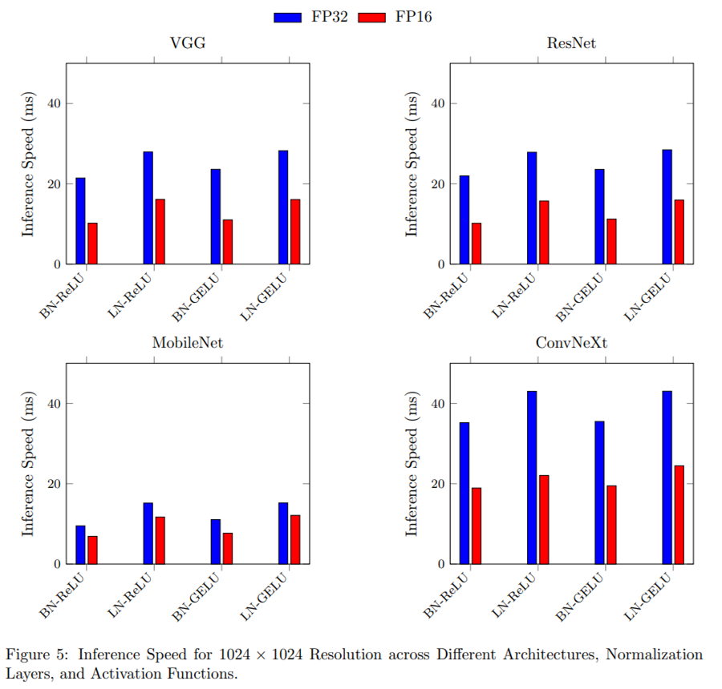

# Comparative Analysis of TensorRT Inference Speeds Across Various Neural Network Block Architectures

## Overview
This repository contains the implementation and results based on the research paper **"Comparative Analysis of TensorRT Inference Speeds Across Various Neural Network Block Architectures"** by Hwa-Jong Park. The paper systematically analyzes the inference speeds of neural network blocks across various combinations of normalization layers, activation functions, and input resolutions.

## Environment
- **OS**: Windows 11
- **CUDA**: 11.8
- **Python**: 3.12
- **PyTorch**: 2.6.0
- **TensorRT**: 8.5.3.1
- **Visual Studio**: 2022

## How to Use

### 1. Generate ONNX Models (Python)

1. Install PyTorch:
   - Visit [https://pytorch.org/](https://pytorch.org/)
   - Select your environment (Windows, CUDA 11.8, Python 3.12)
   - Follow the installation instructions provided

2. Install dependencies:
   ```bash
   pip install -r requirements.txt
   ```

3. Run the main script to generate ONNX models:
   ```bash
   python main.py --input_size 64 --fp16 false
   ```
   
   The ONNX models will be generated in the `onnx/` directory.

### 2. Run TensorRT Inference (C++)

1. Install TensorRT:
   - Download TensorRT 8.5.3.1
   - Extract to `C:\TensorRT-8.5.3.1\`
   - Ensure the directory structure contains: `bin/`, `include/`, `lib/`

2. Set environment variable:
   - Add `C:\TensorRT-8.5.3.1\lib\` to your system PATH

3. Run the C++ inference:
   - Open the Visual Studio solution in `cpp/cpp.sln`
   - Build and run `main.cpp`

## Key Content
### Block Structure
<div style="text-align: center;">
    
</div>

### Experimental Results
#### 64×64 Resolution Results
<div style="text-align: center;">
    
    
</div>

#### 256×256 Resolution Results
<div style="text-align: center;">
    
    
</div>

#### 1024×1024 Resolution Results
<div style="text-align: center;">
    
    
</div>

## Limitations
- Experiments were conducted using dummy images rather than real datasets.
- Testing was performed only on a single hardware configuration (NVIDIA GeForce RTX 3090 Ti), which limits the generalizability of the results.
- The analysis focused solely on inference speed, excluding memory usage, energy efficiency, and actual accuracy metrics.
